# Digital-Modulation
CUFE 2020 - CMP - Digital Communication Project - Third Year semester
in this project we will simulate different digital modulation methods.
## BPSK ( binary phase shift keying)
Phase Shift Keying (PSK) is the digital modulation technique in which the phase of the carrier signal is changed by varying the sine and cosine inputs at a particular time. PSK technique is widely used for wireless LANs, bio-metric, contactless operations, along with RFID and Bluetooth communications.
Binary Phase Shift Keying (BPSK) is also called as 2-phase PSK or Phase Reversal Keying. In this technique, the sine wave carrier takes two phase reversals such as 0° and 180°.
BPSK is basically a Double Side Band Suppressed Carrier (DSBSC) modulation scheme, for message being the digital information.
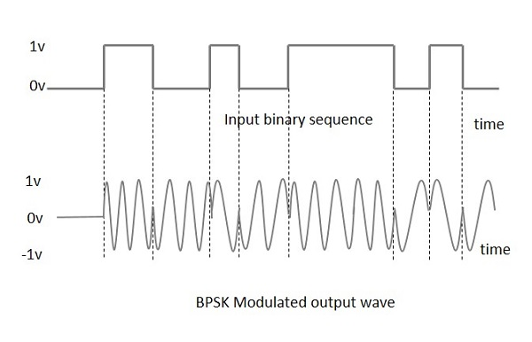
### Gemotrical representation 
We know that BPSK signal carries the information about two symbols. These symbols are symbol ‘1’ and symbol ‘0’. We can represent BPSK signal geometrically to show these two symbols. We know that BPSK signal is expressed as,s(t)=b(t)v2Pcos(2pfct)
on rearranging the equation, s(t)=b(t)vPTb.(v2/Tb) cos(2pfct)
now, let ?1(t)= (v2/Tb) cos(2pfct) represents an orthonormal carrier signal.
let Now Eb=PTb Therefore, s(t)= ±vEb?1(t), and assume Eb=1.
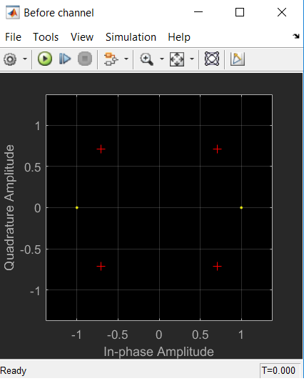

### Steps of simulation ( reproduce the figures )
1. #### Open Model
	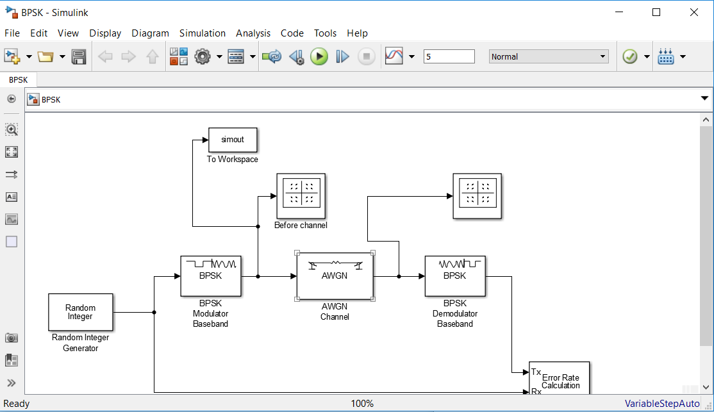
1. #### Change Channel EbNo
	Change channel EbNo(noise ratio ) to variable produced by BerTool.
    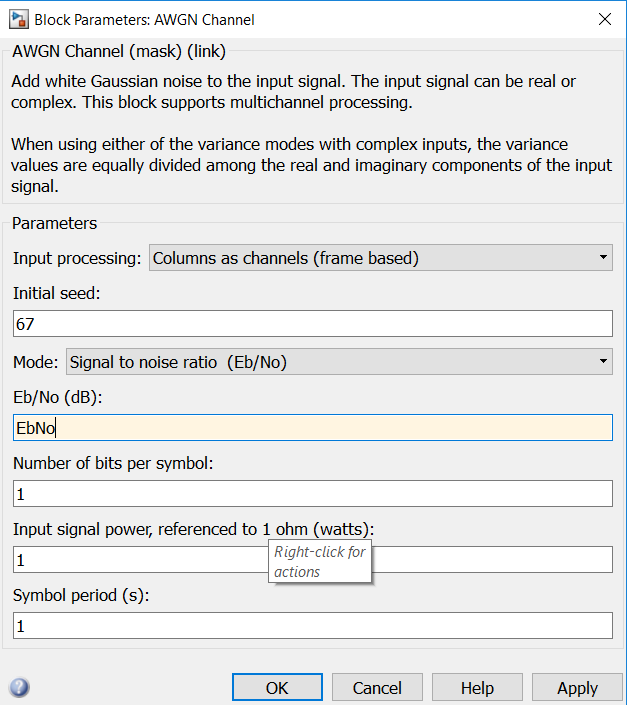
1. #### Open BerTool
	
1. #### change the value of Eb/No 
	Change the value to be Eb/No to take values from -10:10 db.
    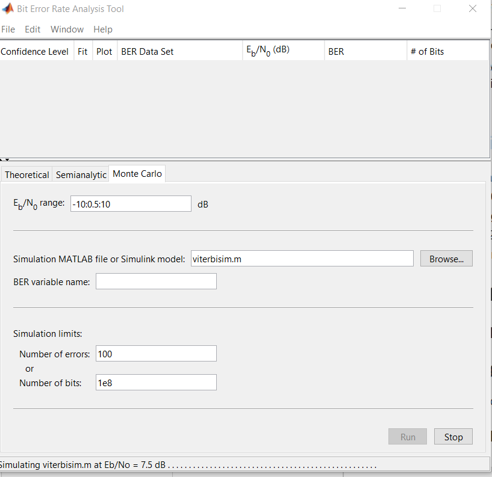
1. #### Choose the file specified 
	choose the file of the design and set error variable to the output of Bet error Rate component in 
    the model File ( in my model the variable name is ErrorVec)
    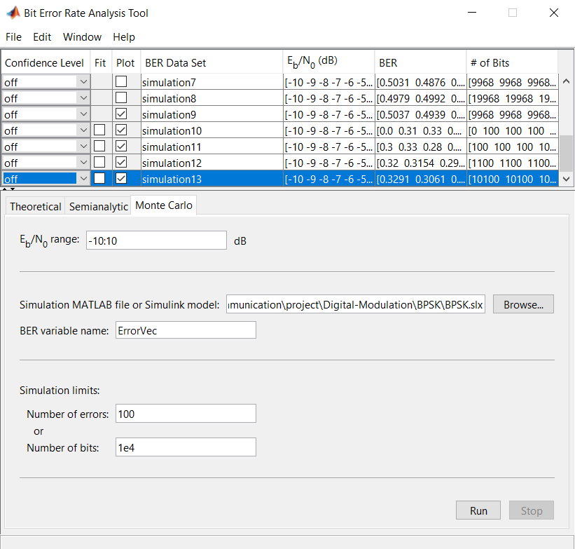
1. #### Run to get the graphs.
1. #### Note 
	it is better to increase the simulation time more than (default value 10).
    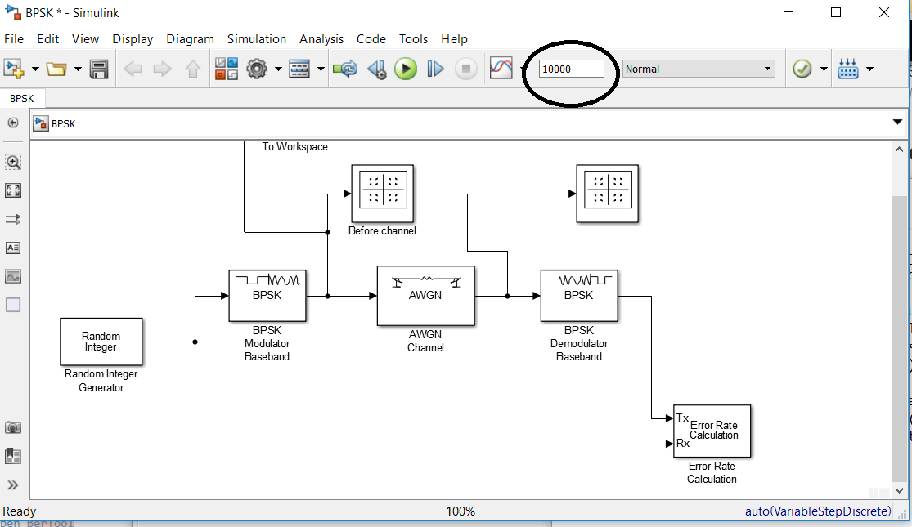

## FSK (  Frequency shift keying)
As its name suggests, a frequency shift keyed transmitter has its frequency shifted by
the message.
Although there could be more than two frequencies involved in an FSK signal, in
this experiment the message will be a binary bit stream, and so only two frequencies
will be involved.
The word ‘keyed’ suggests that the message is of the ‘on-off’ (mark-space) variety,
such as one (historically) generated by a morse key, or more likely in the present
context, a binary sequence. The output from such a generator is illustrated in
Figure  below.

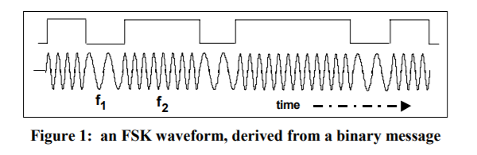

*** to get the figures do the same steps of simulation in BPSK ***

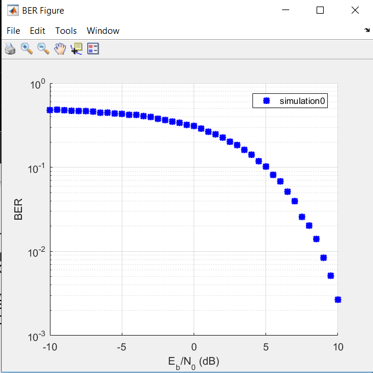
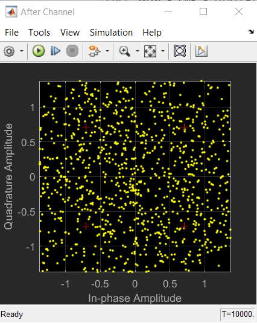
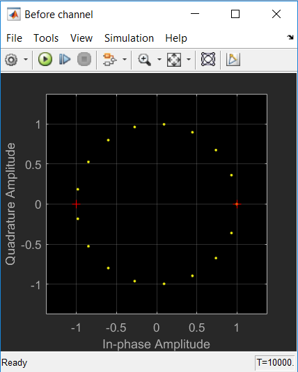

### Note 
after channel and before channel graphs (constellation diagrams) don't give us useful informations
because FSK doesn't necessarily link carrier phase angle to the data changes (as is necessary in PSK).

## QPSK (  Frequency shift keying)
Quadrature phase shift keying (QPSK) is another modulation technique, and it’s a particularly interesting one because it actually transmits two bits per symbol. In other words, a QPSK symbol doesn’t represent 0 or 1—it represents 00, 01, 10, or 11.

This two-bits-per-symbol performance is possible because the carrier variations are not limited to two states. In ASK, for example, the carrier amplitude is either amplitude option A (representing a 1) or amplitude option B (representing a 0). In QPSK, the carrier varies in terms of phase, not frequency, and there are four possible phase shifts.

We can intuitively determine what these four possible phase shifts should be: First we recall that modulation is only the beginning of the communication process; the receiver needs to be able to extract the original information from the modulated signal. Next, it makes sense to seek maximum separation between the four phase options, so that the receiver has less difficulty distinguishing one state from another. We have 360° of phase to work with and four phase states, and thus the separation should be 360°/4 = 90°. So our four QPSK phase shifts are 45°, 135°, 225°, and 315°.

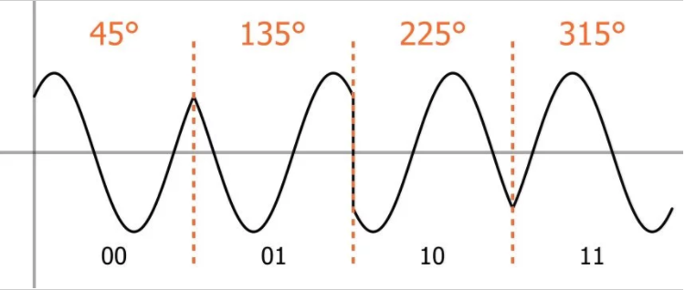
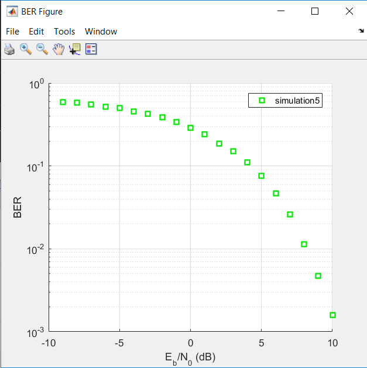
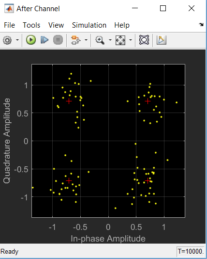
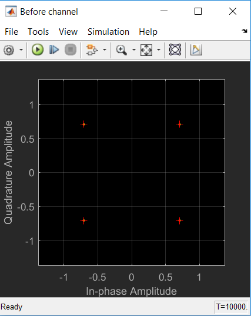

*** to get the figures do the same steps of simulation in BPSK ***

## QAM ( quadrature amplitude modulation)
QAM stands for Quadrature Amplitude Modulation. It is digital modulation technique. This modulation technique is a combination of both Amplitude and phase modulation techniques. QAM is better than QPSK in terms of data carrying capacity. QAM takes benefit from the concept that two signal frequencies; one shifted by 90 degree with respect to the other can be transmitted on the same carrier. For QAM, each carrier is ASK/PSK modulated. Hence data symbols have different amplitudes and phases. 
S(t)= d1(t) cos(2*pi*fc*t)+ d2(t) sin(2*pi*fc*t)

There are two levels of amplitudes for each phase i.e. d1 level and d2 level . There are many variants to this technique. Most popular are 16-QAM, 64-QAM and 256-QAM. The example below explains 16-QAM. In 16-QAM each symbol represents 4 bits ( 16 symbol total we deal with them)

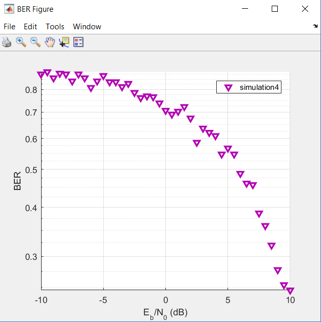
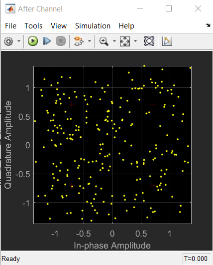
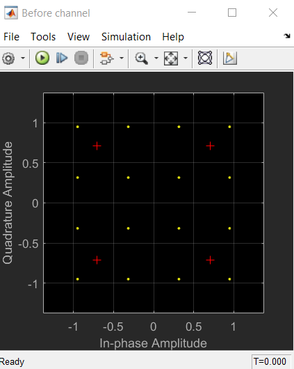

In 64-QAM, each symbol is represented by 6 bits and in 256-QAM, each symbol is represented by 8 bits. As the level increases, QAM technique becomes more bandwidth efficient but it requires very robust algorithms in order to decode complex symbols to bits at receiver.

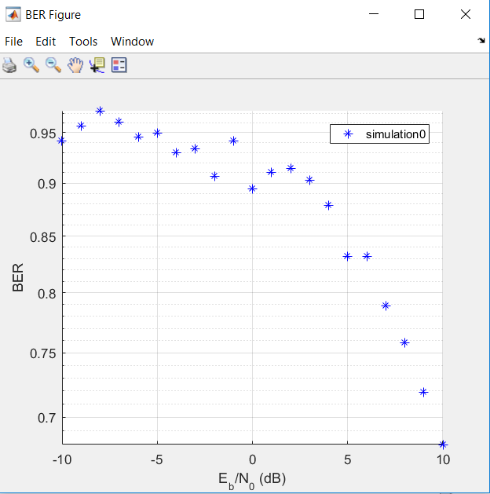
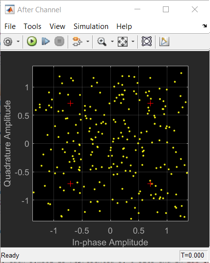
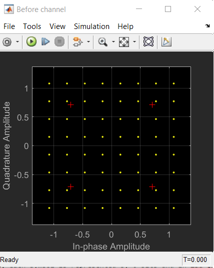

*** to get the figures do the same steps of simulation in BPSK ***
