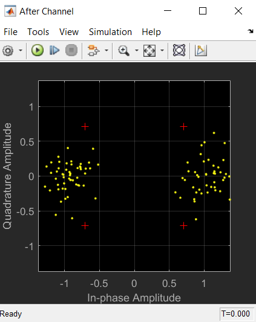

# Digital-Modulation
CUFE 2020 - CMP - Digital Communication Project - Third Year semester
in this project we will simulate different digital modulation methods.
## BPSK ( binary phase shift keying)

